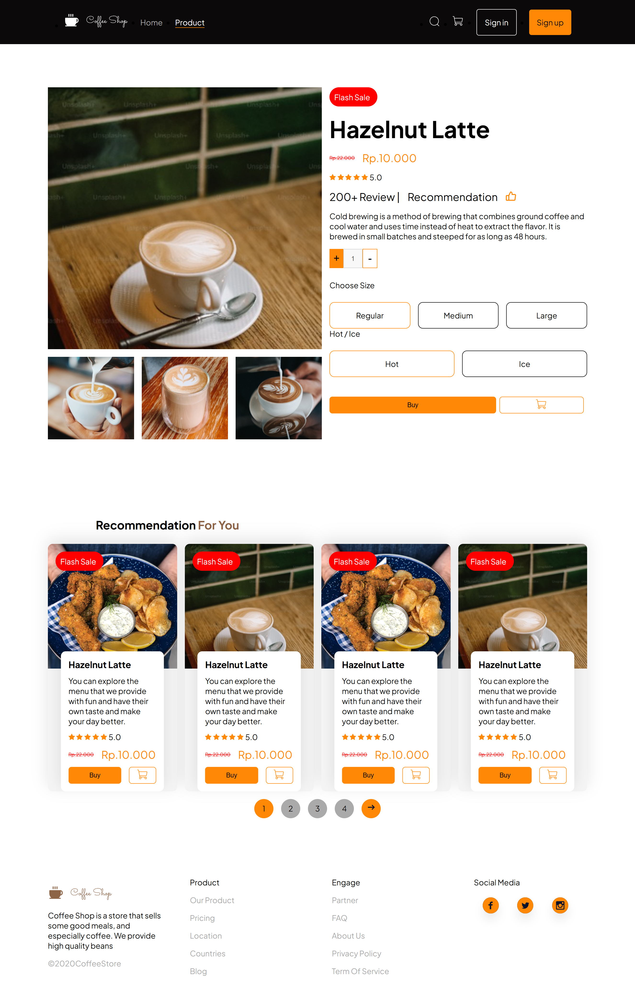

# Slicing Website UI From Design Given In Figma
slicing an coffee shop website ui

## Login Page

## Register Page

## Forgot Page

## Home Page

## Product Page

## Product Detail Page

## How to run it
- simply just download the source code
- open index.js in browser